# skai_universal_forecaster

# Chronos Pipeline

This pipeline provides tools for downloading, preprocessing, and analyzing light curve data from variable stars, with a focus on enabling small-scale experiments and visualizations to gain insights into astronomical time series data.

## Overview

The CRDS pipeline consists of several stages:

1. **Download** - Retrieve variable star light curve data from the ZTF (Zwicky Transient Facility) catalog 
   [(See Section 1)](#1-download-data)
2. **Preprocess** - Transform raw light curves into phase-folded, fixed-frequency representations
   [(See Section 2)](#2-preprocess-data)
3. **Train** - Generate training data and train Chronos models for light curve prediction
   [(See Section 3)](#3-train-models)
4. **Forecast** - Use trained models to predict future light curve behavior
   [(See Section 4)](#4-forecast-evaluation)
5. **Cluster** - Apply K-means clustering to classify variable stars based on their light curve patterns
   [(See Section 5)](#5-clustering-evaluation)
## Requirements

- Python 3.7+
- CUDA-compatible GPU for training (recommended)
- Required packages (see `requirements.txt`)

## Installation

```bash
git clone https://github.com/yourusername/crds-pipeline.git
cd crds-pipeline
pip install -r requirements.txt
```

## Usage

### 1. Download Data

Download light curve data for variable stars from the ZTF catalog.

```bash
python -m src.tasks.download \
  --output-dir ./data/download/run-0 \
  --n 2 \
  --class-ids 1 2 5
```

This command downloads 2 stars from each of classes 1, 2, and 5. Adjust the parameters to download more stars or different classes.

**Parameters:**
- `--output-dir`: Directory to save downloaded data
- `--n`: Number of stars to download per class
- `--class-ids`: List of variable star classes to download (e.g., 1=RR Lyrae ab, 2=RR Lyrae c, 5=Eclipsing binary EW)

**Outputs:**
- Light curve CSV file at `./data/download/run-0/lightcurves.csv`
- Plot images of individual light curves in class subdirectories

**Example Visualizations:**

<div align="center">
  <p><b>Sample Downloaded Light Curves:</b></p>
  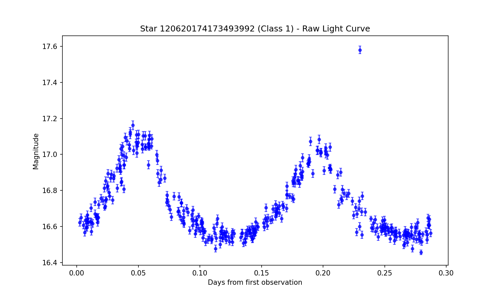
  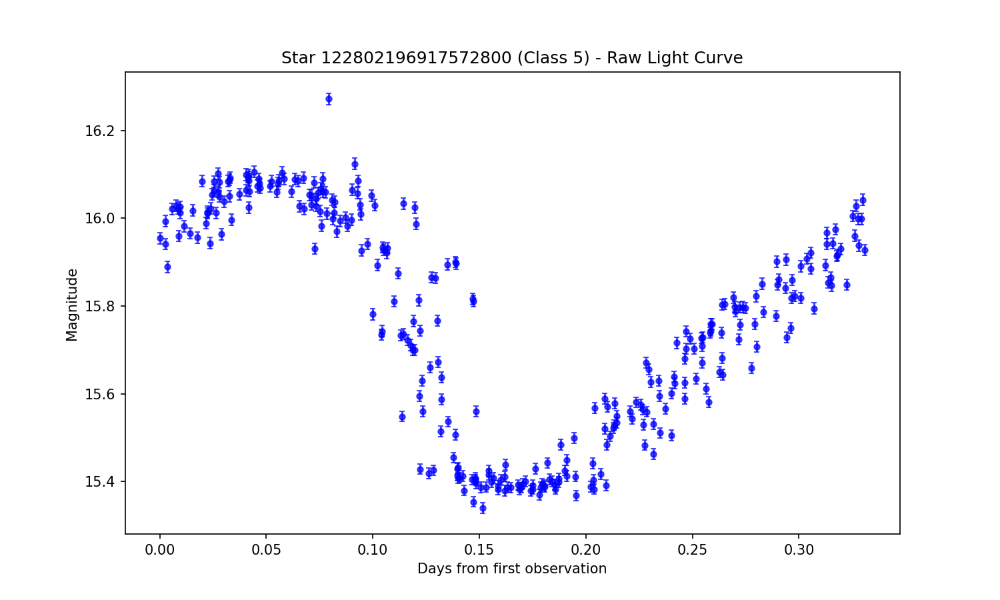
  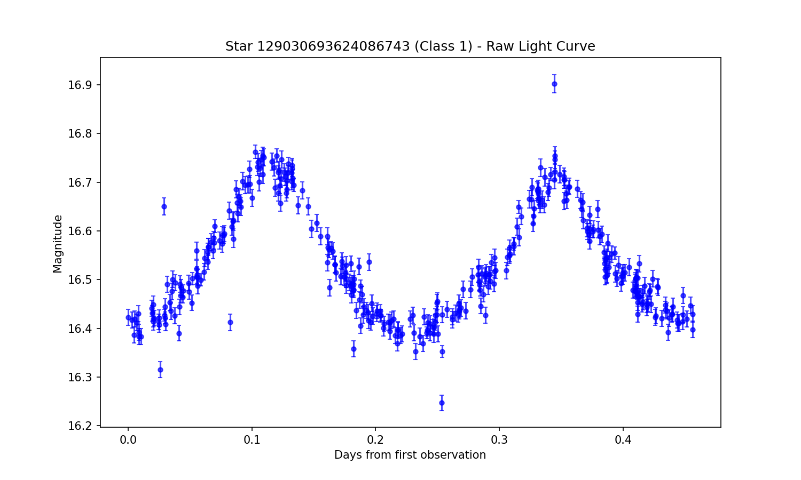
  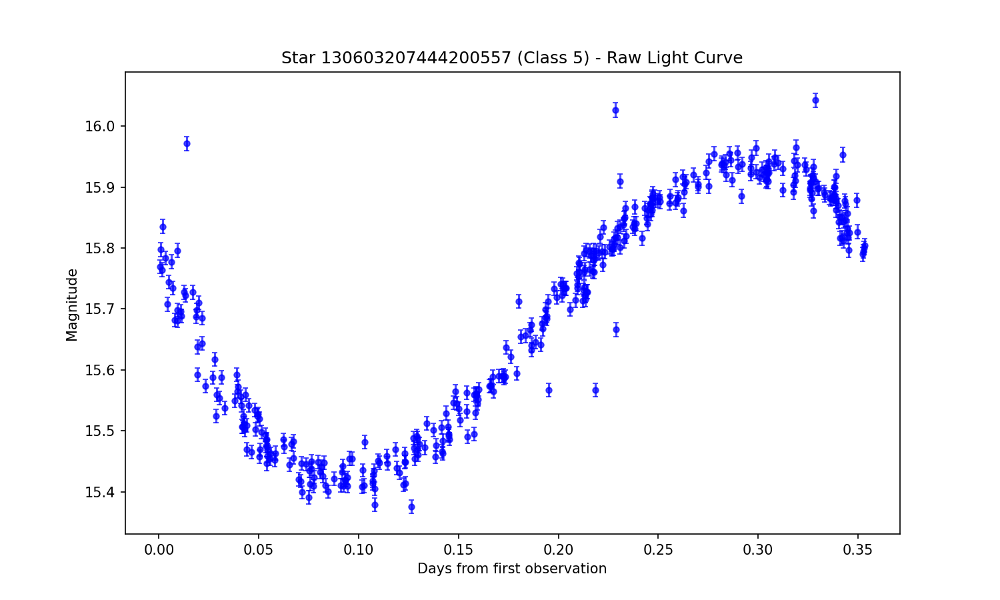
</div>

### 2. Preprocess Data

Convert raw light curves into phase-folded, fixed-frequency time series suitable for analysis.

```bash
python -m src.tasks.preproc \
  --input-file ./data/download/run-0/lightcurves.csv \
  --output-dir ./data/processed/run-0 \
  --stars-per-class 2 \
  --class-ids 1 2 \
  --band g \
  --plot
```

This command processes the downloaded data, keeping 2 stars from classes 1 and 2, using the g-band photometry, and generating visualization plots.

**Parameters:**
- `--input-file`: Path to the downloaded light curves CSV
- `--output-dir`: Directory to save processed data
- `--stars-per-class`: Number of stars to process per class
- `--class-ids`: List of variable star classes to process
- `--band`: Photometric band to use (g, r, or i)
- `--plot`: Generate plots of processed light curves

**Outputs:**
- Processed CSV file at `./data/processed/run-0/processed_lightcurves.csv`
- Plot images of processed light curves if `--plot` is specified

**Example Visualizations:**

<div align="center">
  <p><b>Phase-folded Processed Light Curves:</b></p>
  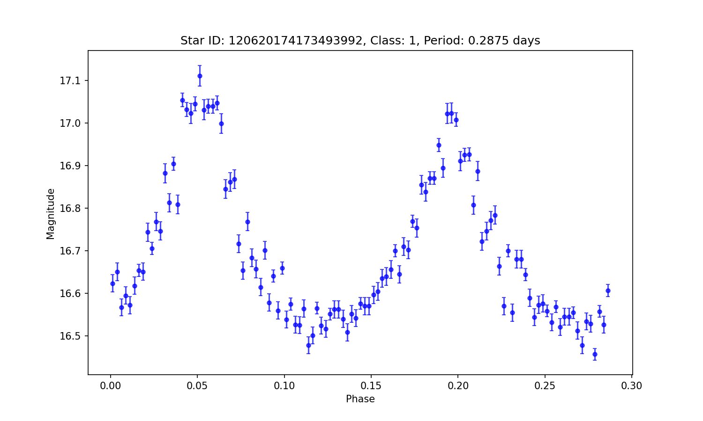
  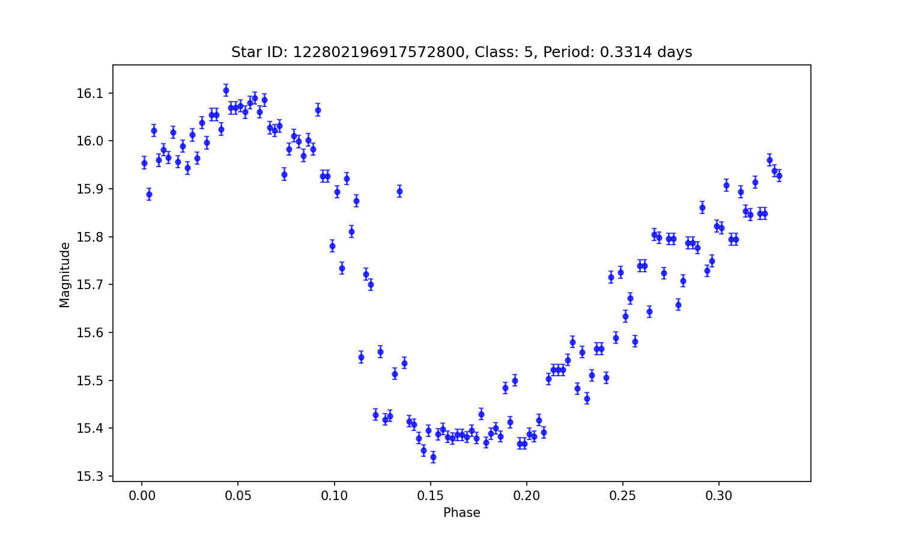
  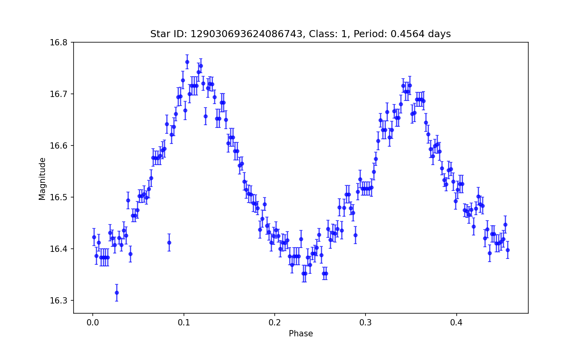
  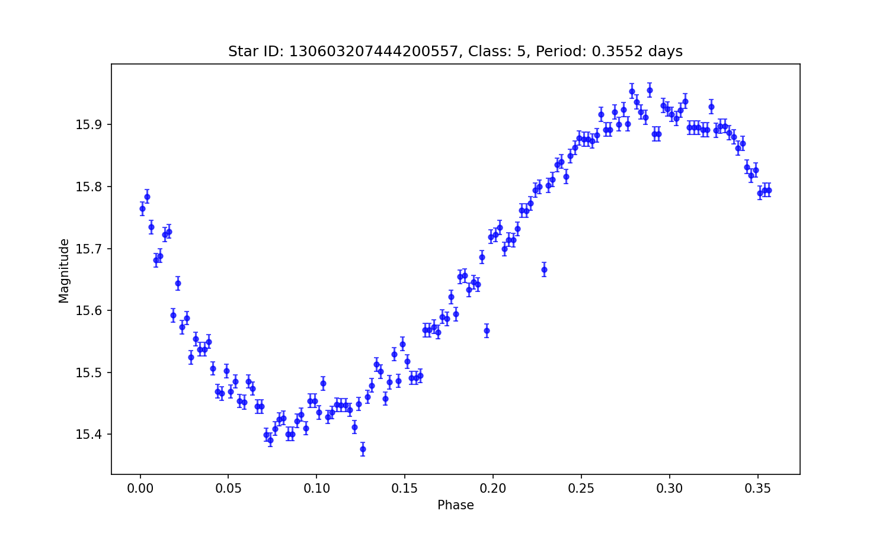
</div>

### 3. Train Models

Train Chronos models on the processed light curve data.

First, convert the processed data to arrow format required by GluonTS/Chronos:

```bash
python -m src.tasks.train.chronos.generate_data \
  --input-files ./data/processed/run-0/processed_lightcurves.csv \
  --output-file ./data/train/run-0/data/data.arrow
```

Then, train the model using a configuration file:

```bash
export HF_HOME=/path/to/huggingface_cache  # Optional: Set HuggingFace cache location
export CUDA_VISIBLE_DEVICES=0,1,2,3       # Optional: Specify which GPUs to use

python -m src.tasks.train.chronos.train --config src/tasks/train/chronos/configs/pretrain_crds1.yml
```

**Parameters:**
- For `generate_data`:
  - `--input-files`: Path(s) to processed light curve CSV file(s)
  - `--output-file`: Path to save the arrow format data

- For `train`:
  - `--config`: Path to the training configuration YAML file

**Outputs:**
- Arrow format dataset at `./data/train/run-0/data/data.arrow`
- Trained model checkpoints in the directory specified in the config file
- Training logs and metrics

**Example Visualizations:**

<div align="center">
  <p><b>Model Fitting on Training Data:</b></p>
  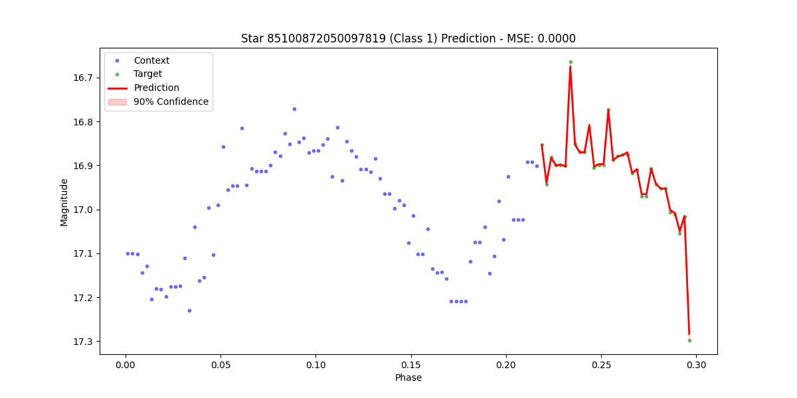
  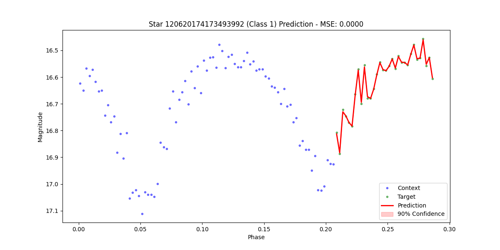
  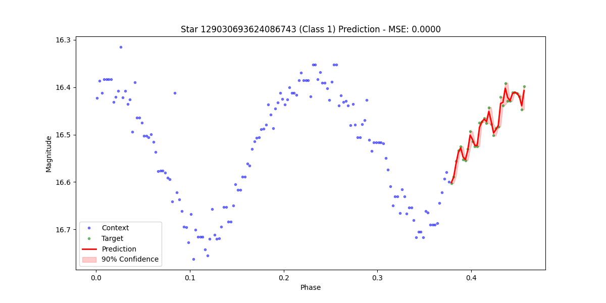
  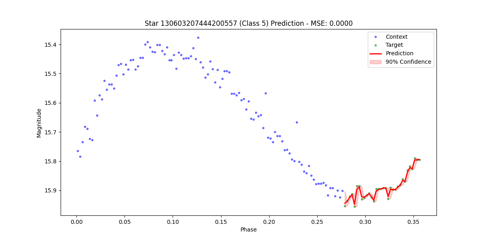
</div>

### 4. Forecast Evaluation

Evaluate the model's ability to forecast future points in light curves.

```bash
python -m src.tasks.eval.forecast.chronos \
  --model-path amazon/chronos-bolt-base \
  --data-path ./data/processed/run-0/processed_lightcurves.csv \
  --output-dir ./data/eval/run-0/forecast
```

This command uses a pre-trained model (or your own trained model) to predict future values in the light curves and generates visualization plots.

**Parameters:**
- `--model-path`: Path to the Chronos model (local path or Hugging Face model ID)
- `--data-path`: Path to the processed light curves CSV
- `--output-dir`: Directory to save evaluation results and plots

**Outputs:**
- Forecast plots for each light curve, showing context data, actual values, and predictions
- Metrics summarizing forecast accuracy

**Example Visualizations:**

<div align="center">
  <p><b>Forecasting Light Curve Future Points:</b></p>
  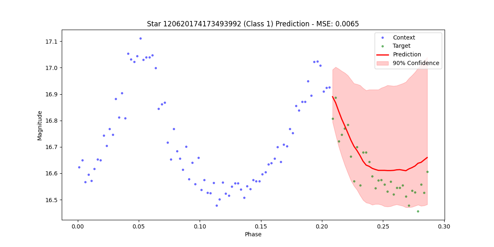
  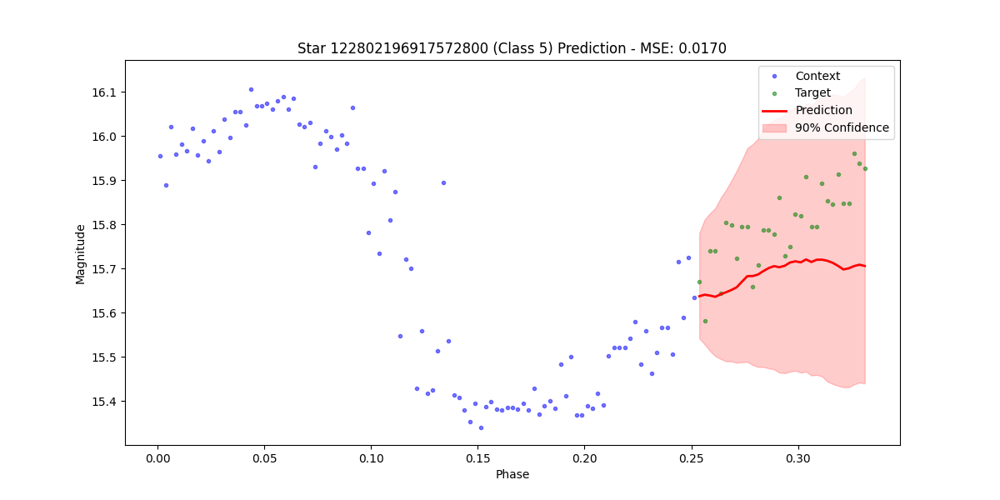
  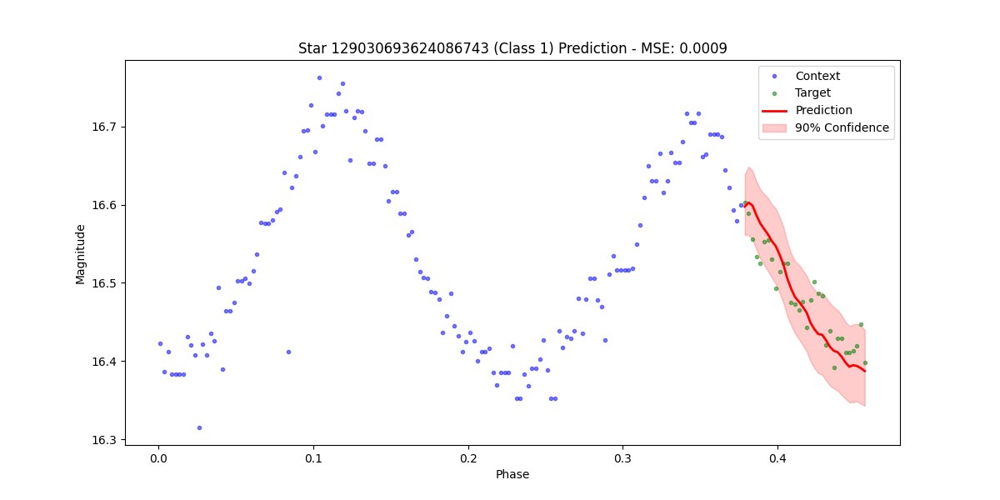
  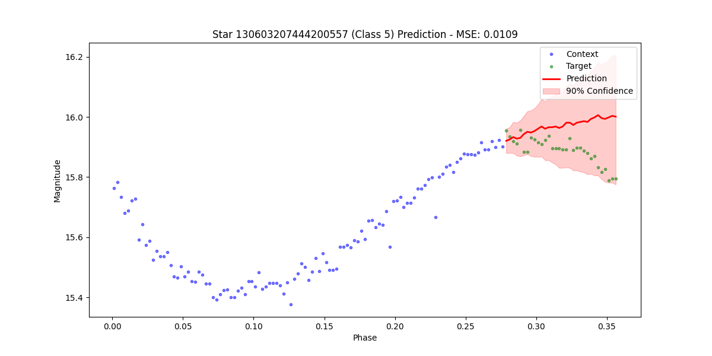
</div>

### 5. Clustering Evaluation

Apply K-means clustering to classify variable stars based on their light curve patterns.

```bash
python -m src.tasks.eval.classification.kmeans \
  --model-path amazon/chronos-bolt-base \
  --data-path ./data/processed/run-0/processed_lightcurves.csv \
  --output-dir ./data/eval/run-0/kmeans
```

**Parameters:**
- `--model-path`: Path to the Chronos model for feature extraction
- `--data-path`: Path to the processed light curves CSV
- `--output-dir`: Directory to save clustering results and plots

**Outputs:**
- Clustering plots showing the distribution of light curves in feature space
- Cluster assignment for each light curve

**Example Visualization:**

<div align="center">
  <p><b>K-means Clustering Results:</b></p>
  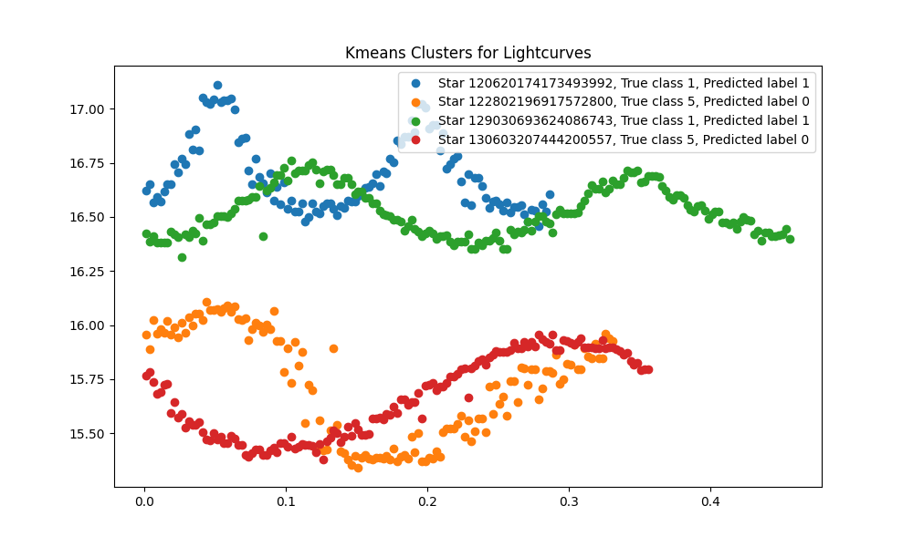
</div>

## Project Structure
